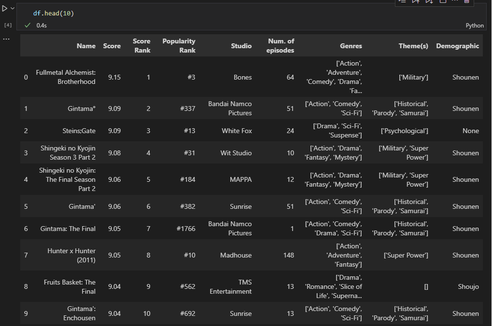

# MyAnimeList crawler
## A simple crawler using Selenium that scrapes info from the animes in the 'Top Anime' section of the MyAnimeList website.
This utility crawler gets the following information on each anime shown in the 'Top Anime' section on the MAL website:
- Anime name
- Anime score
- Anime popularity rank
- Studio that made the anime
- Number of episodes
- Genres
- Theme(s)
- Demographic

After finishing its crawl, it exports all the info to a dataframe in a .csv file.

The full dataset can be downloaded on [Kaggle](https://www.kaggle.com/datasets/brunobacelardc/myanimelist-top-1000-anime).

Sample picture of the dataframe.
